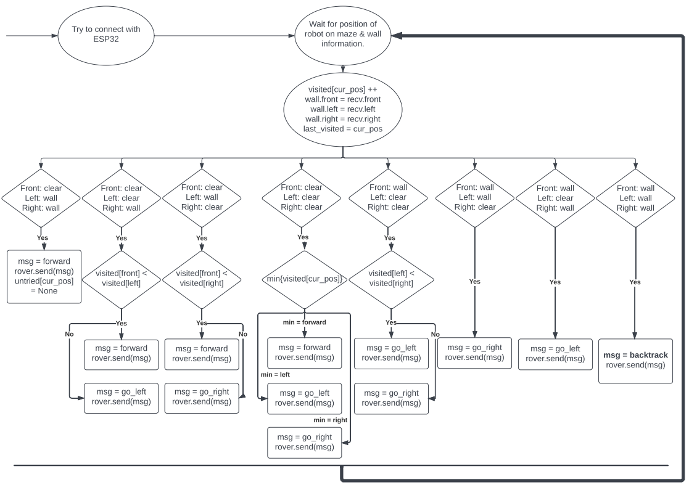

# Exploration Algorithm

The exploration algorithm will work as follows.


The maze will be split up into blox, with each block being assigned a coordinate.

At the starting position, the robot will use beacons to determine its starting position and the surrounding walls.

CONCERN: Are we always starting from the edge of a maze? If no, then need at initialisation also need to send info about the wall BEHIND the robot.

With this information, the server will send the robot directions on where to go next. The robot needs to move by one coordinate.

After moving that one coordinate, it the cycle will repeat and the rover will give the server information on the syrrounding walls etc.

The decision of when to do an accurate survey of the coordinates can be decided on the ESP32 itself. The server will assume that whatever coordinates the ESP32 sends it is correct.

The ESP32 will probably only do a proper survey of the beacons when there is a decision to be made.

## Backtracking

This is a movement function that the ESP32 must be able to execute when it reaches a dead end. Perhaps the server will send the ESP32 coordinates to backtrack to, or the ESP32 remembers the last decision point it came from and returns to it.

Either way, the ESP32 needs to remember the directions it took to get there.

One possible implementation is that the server enters a 'backtrack state'. While it is in this state, it gives the robot directions to get back to the last decision point. So move coordinate by coordinate back to the last decision point.

Once it reaches the last decision point, then leave this backtrack state and give directions to follow the other path!

It will probably look something like this:

```

rover.send(turn_around)

while (visited[cur_pos] is empty) {
    direction = get_directions(cur_pos.last_visited)
    rover.send(direction);
}

```

## What is stored?

Each cell would store a cell_type which can either be Wall (1) or Path (0)

If the cell is a path, store a parent pointer (origin), and also visited[curr_pos], which stores how many times we visited a cell.

If all the decisions have a visited value of greater than 2, we are done.

This is Tremaux.
